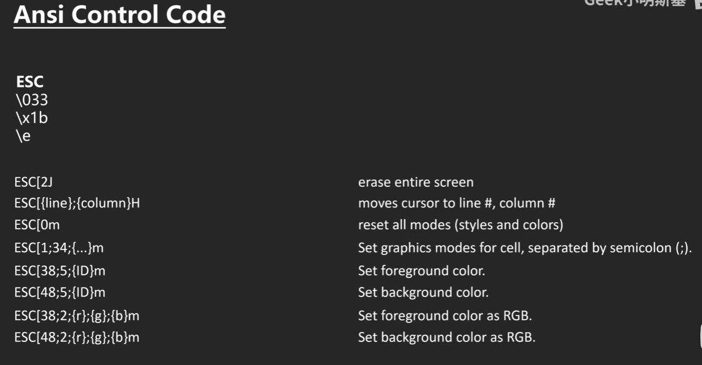
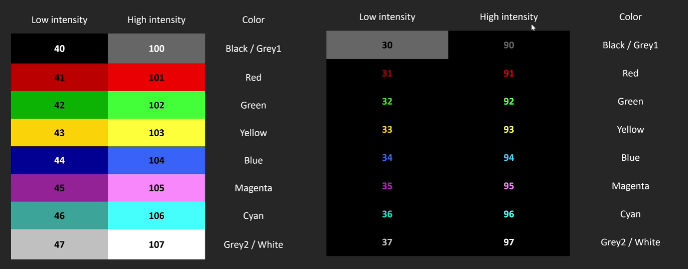
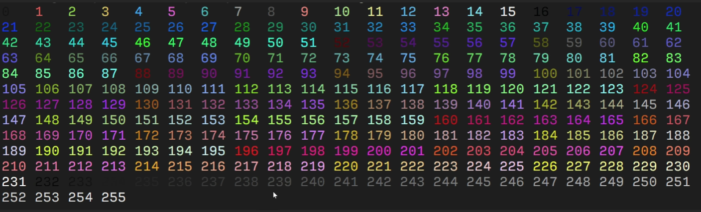

# Tetriz

### 控制台字符
> [参考来源](https://gist.github.com/fnky/458719343aabd01cfb17a3a4f7296797)

### tc 命名空间函数

> void move_to(int row,int col);
> 移动到某行某列

> void set_fore_color(int id);
> 设置前景色

> void set_back_color(int id);
> 设置背景色

> void clean_screen();
> 清空屏幕

> void reset_color();
> 重置颜色

### utils 命名空间

> int fps();
> 返回刷新次数

### draw 命名空间

> void window(int x,int y,int width,int height,std::string title);
> 在x,y(两个内容算一个y像素)处画一个width宽,height高的窗口

### game 命名空间

> void window(int x,int y,int width,int height,std::string title);
> 在x,y(两个内容算一个y像素)处画一个width宽,height高的窗口